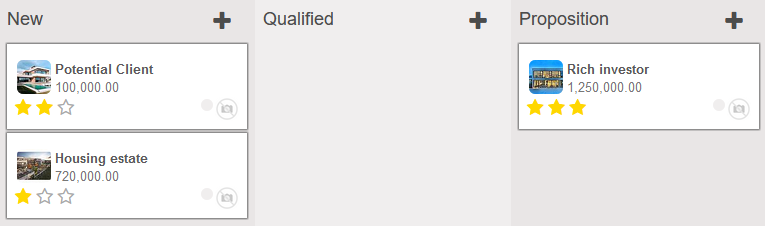

# Odoo-CRM-Module-Extension
Module extending crm_lead model in CRM App by additional fields and new related model - extend_lead.obstacle.

### New fields in crm.lead:
* `expiration_date` - date field,
* `additional_info` - text field,
* `marketing_consent` - boolean field,
* `obstacles` - One2many relation - list of related obstacles,
* `difficulty` - integer - dynamically calculated from obstacles,
* `image` - binary field - used as an icon in kanban view,
* `image_small` - binary field - contains above image in low resolution.

 

### Fields in extend_lead.obstacle:
* `lead_id` - key to crm.lead,
* `description` - text field,
* `difficulty` - selection field - available options:  `(1, 'Low')`, `(2, 'Normal')`, `(3, 'High')`, `(4, 'Very High')`

 

### Screenshots:

